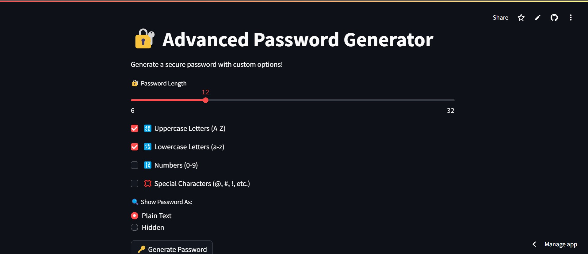

# 🔐 Advanced Password Generator

A secure and customizable **Password Generator** built with **Streamlit** to create strong passwords based on user preferences.

## 🚀 Features

✅ Generate passwords with customizable options:
- **Uppercase Letters (A-Z)**
- **Lowercase Letters (a-z)**
- **Numbers (0-9)**
- **Special Characters (@, #, !, etc.)**

✅ **Adjustable password length** (6 to 32 characters)
✅ **Option to show/hide password** for security
✅ **One-click copy to clipboard**
✅ **User-friendly interface**
✅ **Mobile responsive design**

---

## 🛠️ Installation & Setup

Follow these steps to run the app on your local machine:

### 1️⃣ Clone the Repository
```bash
git clone https://github.com/codewithshabbir/password-generator-python.git
cd password-generator-python
```

### 2️⃣ Install Dependencies
```bash
pip install -r requirements.txt
```

### 3️⃣ Run the App
```bash
streamlit run app.py
```

---

## 🌐 Live Demo
[**🚀 Try it Live**](https://password-generator-codewithshabbir.streamlit.app/)

---

## 🎯 Screenshots


---

## 👨‍💻 Developer
Made with ❤️ by **[Muhammad Shabbir](https://codewithshabbir.vercel.app/)**

📌 **GitHub:** [@codewithshabbir](https://github.com/codewithshabbir)  
📌 **Portfolio:** [codewithshabbir.vercel.app](https://codewithshabbir.vercel.app/)

---

## 📜 License
This project is open-source and available under the **MIT License**.